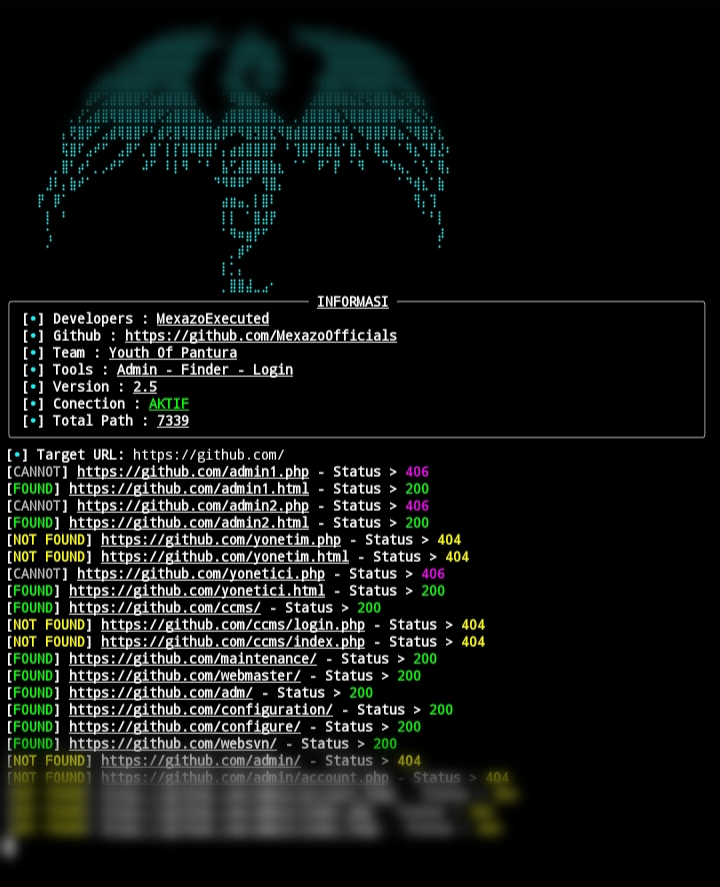

<div align="center">
  



### [](https://github.com/MexazoOfficials/admin-finder/stargazers)

**Developed by MexazoExecuted | Team Youth Of Pantura**

[](https://github.com/MexazoOfficials)
[](https://t.me/YouthOfPantura)

</div>

---

### 📌 ABOUT TOOL

<div align="center">

| Feature | Status |
|---------|--------|
| Auto Update Path from GitHub | ✅ |
| Bypass Cloudflare 90%| ✅ |
| Anti Block & Recovery System 80% | ✅ |

</div>

---

## 🚀 INSTALL & RUN

<details>
<summary><b>📱 Termux (Android)</b></summary>

```bash
pkg update && pkg upgrade -y
pkg install python git -y
git clone https://github.com/MexazoOfficials/Admin-Finder.git
cd Admin-Finder
pip install -r requirements.txt
python run.py
```

</details>

<details>
<summary><b>🐧 Linux (Ubuntu/Debian/Kali)</b></summary>

```bash
sudo apt update && sudo apt upgrade -y
sudo apt install python3 git python3-pip -y
git clone https://github.com/MexazoOfficials/Admin-Finder.git
cd Admin-Finder
pip3 install -r requirements.txt
python3 run.py
```

</details>

<details>
<summary><b>🪟 Windows (CMD/PowerShell)</b></summary>

```cmd
git clone https://github.com/MexazoOfficials/Admin-Finder.git
cd Admin-Finder
pip install -r requirements.txt
python run.py
```

</details>

---

🔧 DEPENDENCIES INSTALLATION

```bash
pip install requests cloudscraper rich
```

Or using requirements.txt:

```bash
pip install -r requirements.txt
```

For Linux:

```bash
pip3 install -r requirements.txt
```

💻 HOW TO USE

```bash
python run.py
```

Then enter target URL:

```
[+] Target URL: https://example.com/
```

---

📁 FILE STRUCTURE

```
admin-finder/
├── 🐍 run.py
├── 🖼️ image.jpg
├── 📄 admin_found.txt
├── 📦 requirements.txt
└── 📖 README.md
```

---

🔄 UPDATE TOOL

```bash
cd Admin-Finder
git pull origin main
```
---

📜 LICENSE

```
MIT License

Copyright (c) 2024 MexazoExecuted

Permission is hereby granted, free of charge, to any person obtaining a copy
of this software and associated documentation files, to deal in the Software
without restriction, including without limitation the rights to use, copy,
modify, merge, publish, distribute, sublicense, and/or sell copies of the
Software.
```

---

📦 REQUIREMENTS.TXT

```txt
requests>=2.28.0
cloudscraper>=1.2.71
rich>=13.0.0
```

---

<div align="center">

🌟 THANKS FOR USING 🌟

Made with ❤️ by Youth Of Pantura
